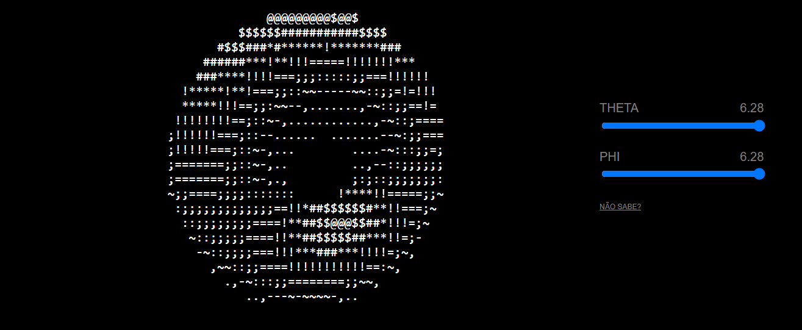

# DONUT 3D 
👨‍🏫VISUALIZAÇÃO EM ASCII DE UMA "ROSQUINHA" (OU DONUT), RENDERIZADA EM 3D, MAS UTILIZANDO CÁLCULOS TRIDIMENSIONAIS PARA SIMULAR UM EFEITO DE ROTAÇÃO.

  

## DESCRIÇÃO:
Este projeto é uma visualização em ASCII de uma "rosquinha" (ou **donut**), renderizada em 3D, mas utilizando cálculos tridimensionais para simular um efeito de rotação. O código, em essência, faz a projeção de um objeto 3D (toroide) e o desenha em uma tela de caracteres ASCII, girando continuamente.

## ESTRUTURA:
- O projeto consiste em uma interface gráfica que exibe um donut animado, utilizando caracteres ASCII para desenhá-lo.
- Além da visualização do donut, há dois controles deslizantes (**sliders**) que permitem ao usuário ajustar parâmetros da rotação do objeto:
    - **Theta**: Controla o número de divisões no círculo maior (a "base" do donut).
    - **Phi**: Controla a quantidade de subdivisões do círculo menor (o "tubo" do donut).

## FUNCIONALIDADES:
- O donut gira em 3D, e a rotação é projetada em 2D para que possa ser exibida no terminal de caracteres ASCII. O código usa trigonometria para calcular a rotação do donut em torno de dois eixos diferentes (`A` e `B`).
- A cada quadro (frame), os valores de `A` e `B` são atualizados para que o donut pareça girar de forma contínua.
- A rotação contínua é controlada pelos ângulos `THETA` e `PHI`, que podem ser ajustados pelos sliders na interface.
- Um algoritmo de iluminação simples é aplicado, onde diferentes caracteres (`.,-~:;=!*#$@`) representam níveis de brilho, simulando luz refletida em diferentes partes do donut.

## COMO FUNCIONA?
- **Pré-renderização da tela**: O array `b` representa o buffer de saída, ou seja, os caracteres que serão exibidos na tela, enquanto o array `z` armazena a profundidade de cada ponto (usado para decidir qual ponto está "na frente" e deve ser renderizado).
- **Cálculos de rotação e projeção**: 
    - `A` e `B` são ângulos de rotação, sendo incrementados a cada quadro para que o donut pareça estar girando.
    - As funções seno (`sin`) e cosseno (`cos`) são usadas para calcular as novas posições dos pontos da superfície do donut, projetando as coordenadas 3D em 2D.
- **Simulação de luz**: O valor de `N` é calculado com base no ângulo da superfície do donut em relação à "fonte de luz". Isso determina qual caractere ASCII será usado para representar essa parte do donut (mais escuro ou mais claro).
- **Renderização**: O conteúdo de `b` (que contém os caracteres ASCII organizados) é passado para o elemento HTML `<pre>` a cada 30ms, criando a animação.

## CONTROLES DINÂMICOS:
- Os sliders permitem ao usuário ajustar `THETA` e `PHI` em tempo real, modificando a densidade da geometria do donut.
- Esses valores são atualizados continuamente, e o donut se ajusta ao novo número de subdivisões, alterando a aparência da animação.

## OBJETIVO:
- O objetivo deste projeto é demonstrar um conceito clássico de renderização 3D em um formato extremamente simples: utilizando apenas texto (ASCII) e cálculos matemáticos de projeção 3D.
- É uma maneira divertida e educativa de explorar conceitos de geometria e visualização tridimensional, além de mostrar como criar gráficos interativos com HTML, CSS e JavaScript puro.

## NÃO SABE?
- Entendemos que para manipular arquivos em `HTML`, `CSS` e outras linguagens relacionadas, é necessário possuir conhecimento nessas áreas. Para auxiliar nesse aprendizado, oferecemos cursos gratuitos disponíveis:
* [CURSO DE HTML E CSS](https://github.com/VILHALVA/CURSO-DE-HTML-E-CSS)
* [CURSO DE JAVASCRIPT](https://github.com/VILHALVA/CURSO-DE-JAVASCRIPT)
* [CONFIRA MAIS CURSOS](https://github.com/VILHALVA?tab=repositories&q=+topic:CURSO)

## CREDITOS:
- [PROJETO CRIADO PELO "ndrydbv"](https://github.com/ndrydbv/donut)
- [PROJETO EDITADO PELO VILHALVA](https://github.com/VILHALVA)

